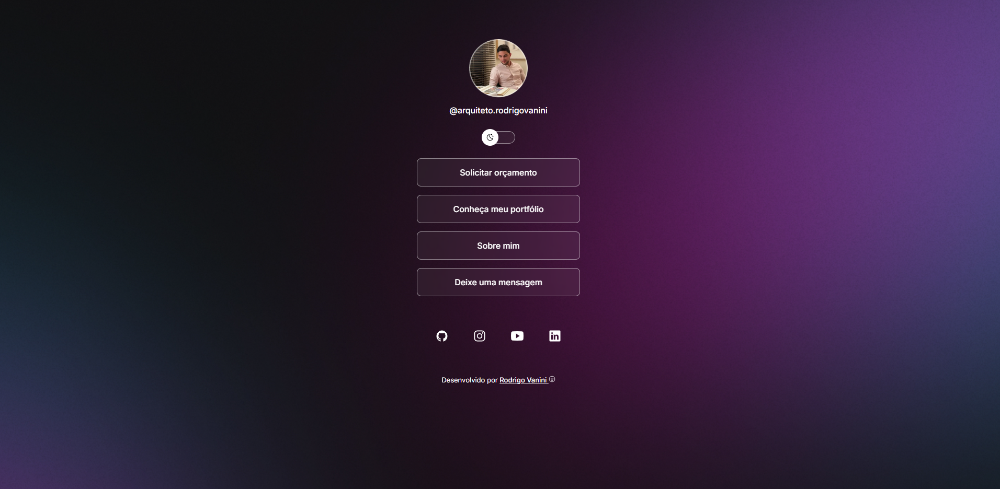

**
SocialLinks
**

  

  

## :clipboard: Page Purpose
SocialLinks is a link aggregator to use as an online business card.

## :computer: Technologies Used
- HTML and CSS
- JavaScript
- Git and GitHub
- Figma

## :bulb: Learnings
While building this project, I had the opportunity to improve my CSS skills. Key takeaways include:

- **Smooth Hover Transitions:** Using the `transition` property to create smooth, visually pleasing hover effects on buttons.
- **Responsive Layout:** Applying techniques to ensure the page adapts to different screen sizes.
- **Visual Effects with `backdrop-filter`:** Applying filters such as blur or brightness to elements that sit behind a specific element.
- **Colors with Transparency (`rgba`):** Using the `rgba` color model to set color opacity, enabling semi-transparent backgrounds and elements.
- **Semantic Structure:** Proper use of HTML tags like `<h1>`, `<h2>`, and `
` to structure content in an accessible, SEO-friendly way.

## :arrow_forward: How to Run
1. Clone this repository to your local machine.
2. Open the `index.html` file in your browser.
